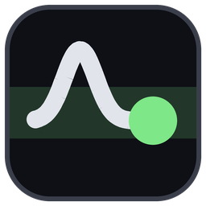

#  vr-cgm-overlay

FreeStyle Libre glucose on your desktop and on your wrist in SteamVR, read through LibreLinkUp.

**FreeStyle Libre only.** Every reading comes from a LibreLinkUp
follower account, and that is the only source there is: no Dexcom, no
Medtronic, no Nightscout, no meter, no CSV.

It runs as an OpenVR overlay, so **no game needs modding or patching** —
the face composites over any SteamVR title.


## Download for Windows

No Python needed. Before anything else, check the account
side described in
[the next section](#first-a-librelinkup-account-that-already-shows-a-reading):
**the LibreLinkUp app on a phone has to show a number**, because this
reads that account and nothing else.

1. From [Releases](https://github.com/p-kitty/vr-cgm-overlay/releases),
   download `vr-cgm-overlay-<version>-windows.zip`.
2. Right-click it, **Extract All**, and put the `vr-cgm-overlay` folder
   wherever you keep programs.
3. Open the folder and double-click **`vr-cgm-overlay.exe`**.
4. Windows says **"Windows protected your PC"**. The program is not
   signed, which costs money every year for a free tool, so Windows has
   never heard of it. Click **More info**, then **Run anyway**. It asks
   again after each update, since each one is a new file.
5. Sign in with the **LibreLinkUp** email and password. They are tried
   against LibreLinkUp before anything is saved, so if the window closes
   and the glucose appears, it worked.
6. For VR, start SteamVR. The face appears on your left controller;
   [Placing the face in VR](docs/placement.md) covers moving it.

Everything it keeps — the settings, including the password in plain
text, the log, and where the window was — is in
**`%APPDATA%\vr-cgm-overlay`**. Paste that into Explorer's address bar
to open it.

**Settings:** click the gear on the face. See [Settings](#settings).

**Updating:** close it, delete the old `vr-cgm-overlay` folder, and
extract the new one in its place. Your settings are not in that folder,
so they stay.

**Starting with Windows:** in PowerShell, run the `.exe` once with
`--install-startup`, dragging the file into the window for its path:

```powershell
& "C:\path\to\vr-cgm-overlay\vr-cgm-overlay.exe" --install-startup
```

It prints nothing, and it adds one shortcut to your Startup folder; see
[Starting with Windows](#starting-with-windows). Run it again after
moving the folder.

**Removing it:** close it, delete the `vr-cgm-overlay` folder and
`%APPDATA%\vr-cgm-overlay`, and the shortcut in `shell:startup` if you
added one. It changes nothing else on the machine.

## Design

```
┌─ LibreLinkUp Cloud (api-jp.libreview.io and friends) ─┐
│  POST /llu/auth/login              → token, region    │
│  GET  /llu/connections             → patientId        │
│  GET  /llu/connections/{id}/graph                     │
└────────────────────┬──────────────────────────────────┘
                     │ HTTPS every 60s (jitter + exponential backoff)
┌────────────────────▼──────────────────────────────────┐
│  vr-cgm-overlay (resident, single process)            │
│                                                       │
│                                  ┌─→ cgm.vr           │
│    cgm.core     ──→ cgm.face  ───┤   pyopenvr         │
│    auth + fetch     PIL drawing  └─→ cgm.desk         │
│                                      tkinter          │
│    cgm.main: 1s draw loop, fetch and track on threads │
└────────────────────┬──────────────────────────────────┘
                     │ SetOverlayTransformTrackedDeviceRelative
           ┌─────────▼──────────┐
           │ SteamVR Compositor │ → wrist-tracked, over every game
           └────────────────────┘
```

The same face has two places to go, and **one process runs both**.
`cgm.vr` puts it on a controller and `cgm.desk` puts it in a desktop
window; neither imports the other, and everything above them — the
login, the fetch schedule, the low alert — happens once and is shared.
So a low is announced once rather than once per screen, and the API sees
one poller however many places you are reading it.

Neither half is compulsory. `--window` leaves SteamVR alone, `--vr`
leaves the window out, and the default is both.

Why it behaves the way it does — separate fetch and draw rates, stale
readings that look stale, a trend fitted here rather than taken from the
API — is in [Why it is built this way](docs/design.md), along with the
quirks of the unofficial API the client works around.

## Running from source

For working on the code. To use it, [download the Windows
app](#download-for-windows) instead; the account section right below
applies either way.

### First, a LibreLinkUp account that already shows a reading

This logs in as a **follower in LibreLinkUp** — the watching app. It is
not LibreLink, which is the app the sensor itself is scanned with. The
two share a name and nothing else, and an account created in the wrong
one logs in perfectly well and follows nobody.

So before installing anything, check that all three are true:

1. The sensor is scanned with the **LibreLink** phone app, so the
   readings reach the cloud at all. A standalone reader uploads nothing
   for this to find.
2. That phone has **shared with a follower**, and the invitation is
   accepted in **LibreLinkUp** — your own second account is the usual
   arrangement.
3. Opening **LibreLinkUp** shows a current number.

If the third is not true, this cannot be either: it reads that account
and does nothing else. `--dry-run` below says so in as many words —
`no connections found; check that follower sharing is set up in the
LibreLinkUp app`.

### Then the install

Needs **Python 3.14 or newer** — any 3.14.x, nothing here cares which
patch release. An older interpreter is turned away at startup rather
than failing halfway through an import.

Name the interpreter rather than trusting whichever `python` is on PATH.
A machine with more than one Python installed will hand you the wrong
one, and installing a fresh Windows build does not change what an
already-open terminal resolves.

```bash
py -3.14 -m venv .venv
.venv\Scripts\Activate.ps1
pip install -e ".[vr]"
cp config.example.toml config.toml
```

`-e` because the package is installed from this checkout rather than
copied out of it: editing a file under `src/` changes what runs, with no
reinstall. `[vr]` adds the SteamVR bindings, which only the overlay
itself loads: `pip install -e .` on its own is enough for `--dry-run`,
`--window`, the tests and every script under `tools/`, since the two
that reach into the overlay stub the bindings out rather than needing
them.

Every later command in this file assumes that environment is active.

Put the `email` and `password` of that LibreLinkUp follower account in
`config.toml` — the login from step 3, not the phone's LibreLink one if
they differ.

Or leave the copy and the editing out: started with no account in
`config.toml`, or with no file at all, `vr-cgm-overlay` opens a small
sign-in window instead, tries the address and password against
LibreLinkUp until a reading comes back, and only then writes the file,
from `config.example.toml`. `--dry-run` does not ask; it says the file
is missing.

That file holds your password, so it is excluded by `.gitignore`. Do not
share or commit it.

Check the API before involving SteamVR.

```bash
vr-cgm-overlay --dry-run
```

A glucose value on the console and a `preview.png` on disk means the API
side is done. Then leave it running.

```bash
vr-cgm-overlay
```

That opens the desktop window and waits for SteamVR. **It does not need
SteamVR to be up**: put the headset on whenever you like and the overlay
appears, quit SteamVR and it goes, and the window carries on either way.
Start it once and leave it there.

A small **VR** appears in the window's top corner while the face is
actually on a controller, and goes away when it is not — SteamVR down, a
controller asleep, or nothing paired yet all look the same from a desk,
and none of them are faults.

Everything the console prints is also kept in **`logs/`**, beside
`config.toml`: a file a day, the last two weeks of them, tracebacks
included. It holds every reading, so it is excluded by `.gitignore` for
the same reason `config.toml` is. `--dry-run` keeps none.

Controller origins differ between Index, Touch and Vive, so assume the
first run needs tuning: see
[Placing the face in VR](docs/placement.md).

### Starting with Windows

Once `--dry-run` works, this saves starting it by hand:

```bash
vr-cgm-overlay --install-startup
```

From the next sign-in on, the window opens by itself with no console
beside it. What that adds is **one shortcut in your Startup folder** —
type `shell:startup` into Win+R to see it — and nothing else: no
registry entry, no service. It runs this checkout's `pythonw.exe` on
the `config.toml` you installed it with, which is checked before
anything is written.

To stop it, any of these:

- `vr-cgm-overlay --uninstall-startup`
- delete the shortcut
- switch it off under **Startup apps** in Task Manager

With no console, anything that stops it at startup — a mistake in
`config.toml`, say — is shown in a dialog instead of printed, and the
rest goes to `logs/`. Starting a second copy on the same config is
refused with a message rather than polling the account twice; close the
window to quit the one that is running.

### Building the Windows app

For handing it to someone with no Python, the same code builds into a
folder with an `.exe` in it:

```bash
pip install -e ".[vr,build]"
python tools/build_exe.py
```

`dist/vr-cgm-overlay/` is the whole app; zip that folder. The build
reads its config from **`%APPDATA%\vr-cgm-overlay\config.toml`** rather
than from a checkout, with `logs/` and `state.json` beside it, so a
build tried on this machine never touches the checkout's config.
With nothing there yet, the first start opens the sign-in window above
and writes it.

A release is that folder, zipped and published by
`.github/workflows/release.yml` when a version tag is pushed — never on
an ordinary push. Bump `version` in `pyproject.toml`, merge, then:

```bash
git tag v0.2.0
git push origin v0.2.0
```

The workflow refuses a tag that does not match the version, runs the
unit tests, builds, and puts the zip on the Releases page.
`--install-startup` from a build registers the `.exe` itself.

## Without a headset

The desktop window is up by default, so there is nothing to do but look
at it. `--window` is for saying you want *only* that:

```bash
vr-cgm-overlay --window
```

No SteamVR, no `openvr`, no headset — a plain `pip install -e .` is
enough, and it is also what to reach for on a machine that has no
SteamVR at all. (A plain `vr-cgm-overlay` there says so in the log and
carries on with the window.) It is the same fetching and the same face,
so everything in
[Configuration](docs/configuration.md) that is not about placement
applies here too: the colour bands, the units, the trend arrow, the
stale greying, and `config.toml` being re-read while it runs.

Useful for a second monitor while you are doing something other than
playing, and useful for anything that takes hours to show itself — a
long session's fetch schedule, a token expiring and being renewed, or
whether `trend.fast_mgdl_min` draws a readable arrow against a real day
rather than a twitchy one. None of those are VR questions, and none of
them are worth wearing a headset for as long as they take to answer.

**The window draws the history sparkline and the overlay does not**, and
that is the one thing the two frontends deliberately disagree about. See
[The history sparkline](docs/graph.md); `graph.in_window` turns it off
if you would rather have the number alone. The same goes for the row
with the average of that history, `average.in_window`; see
[`[average]`](docs/configuration.md#average--the-historys-average).

`alert_on_low` works here through sound. The controller buzz is the one
channel a window has no hardware for; everything about *when* to
announce a low is shared, so with both frontends up you are told once
rather than twice.

The other way round, `--vr` runs the overlay with no window at all —
worth having when the window is one more thing on a taskbar you are not
looking at.

The window opens **where you last left it**, on whichever monitor that
was. The spot is kept in `state.json` beside `config.toml`, which git
ignores; delete it to start over. If that monitor is no longer
attached, the window opens where Windows puts it rather than somewhere
nothing can show it.

## Settings

**Click the gear** in the top corner of the face — or right-click
anywhere on it — for a settings window: thresholds, units, polling,
alerts and the graph, in tabs. It writes `config.toml` and does
nothing else — the running app picks the edit up the same way it picks
up one made in a text editor, and it refuses to write anything the app
would not start from.

Placement is in there too, across the `vr`, `vr orbit` and `vr gaze`
tabs, with `offset` and `rotation_deg` as three boxes each. It is still judged with the headset on — change a number, press
Save, watch the face move — which is the same loop as editing the file,
because both go back through the same watcher. See
[Placing the face in VR](docs/placement.md) for what the numbers mean.

Everything is in `config.toml` either way, and it is **re-read while the
app runs** — edit it with the headset on and the face changes within a
second. Only `[account]` needs a restart (`hand` reopens the overlay by
itself, which takes about a second), and a key nothing recognises stops
the app rather than being silently ignored.

| Where to look | For |
|---|---|
| [Configuration](docs/configuration.md) | Every setting section by section: the units and colour bands, the low alert and when it fires, the trend arrow, how the file is validated and reloaded |
| [Placing the face in VR](docs/placement.md) | `offset` and `rotation_deg`, orbit mode and the arm guides, gaze fading |
| [The history sparkline](docs/graph.md) | `[graph]`: how far back it shows, the fixed axis floor, and what the trace does and does not draw |
| [Why it is built this way](docs/design.md) | The reasoning, and the LibreLinkUp API quirks |

`config.example.toml` carries the same explanations as comments beside
the values, if you would rather read it there.

## Tested on

One setup, and nothing else yet:

| | |
|---|---|
| OS | Windows 11 |
| Python | 3.14 |
| Headset | Meta Quest 3 |
| Link to the PC | Virtual Desktop, with SteamVR started from it |
| LibreLinkUp | One follower account, which logs in at `api.libreview.io` with no region redirect |

Everything outside that table is **untried**, not known to fail:
Quest Link and Air Link, Index, Vive, Pico, Windows Mixed Reality, and
the redirect a login from another region answers with. Reports from any
of them are welcome — say which headset, which link and what you saw.

It needs SteamVR itself as the OpenVR runtime. **OpenComposite does not
provide overlays**, so with it in SteamVR's place the window keeps
working and the face never appears in the headset.

## Known limits

The low-glucose **buzz** is silent on a Quest 3 running through Virtual
Desktop, which is the one setup this has been tried on. It uses the
legacy haptic call, which a driver is free to ignore, so whether it
buzzes on yours is a question only running it answers. This is why
`alert_sound` exists and defaults on: a sound reaches you whatever the
controller driver decides to do with the buzz.

The **sound** goes wherever Windows is sending audio, which for most
setups — anything playing through the desktop and out to headphones
— is already where you are listening. If your headset takes its own
output device and you cannot hear the alert in VR, make it the default
device in Windows. **Both are supplements; the face itself is the real
alert.**

## Cautions

- **FreeStyle Libre through LibreLinkUp is the only supported source.**
  Nothing else is planned, and no setting will point this at another CGM.
- This uses an **unofficial** LibreLinkUp API. Abbott does not support it,
  does not document it, and the app breaks if the API changes without
  notice.
- **Do not use this for medical decisions.** Treat from the official app
  and a glucose meter.
- The polling interval cannot be set below 30 seconds, to avoid getting
  the account blocked.

## License

MIT License. See [LICENSE](LICENSE).
