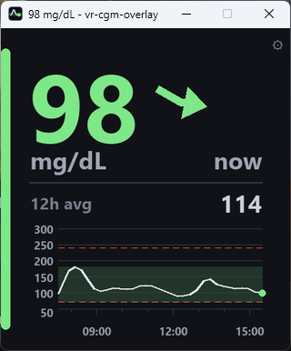

#  vr-cgm-overlay

FreeStyle Libre glucose on your desktop and on your wrist in SteamVR, read through LibreLinkUp.

<video src="https://github.com/user-attachments/assets/9efe404e-5690-42d1-820f-5769808571d1" width="480" controls></video>



**FreeStyle Libre only.** Readings come from a LibreLinkUp follower
account and nowhere else: no Dexcom, Medtronic, Nightscout, meter or CSV.

**See it in two places at once:**

- **On your desktop**, in a small window.
- **In VR**, on your controller like a watch. It is an OpenVR overlay, so
  it shows over any SteamVR game with **no modding or patching**.


## Download for Windows

No Python needed. First check that
[the LibreLinkUp app on a phone shows a number](#first-a-librelinkup-account-that-already-shows-a-reading)
— this reads that account and nothing else.

1. From [Releases](https://github.com/p-kitty/vr-cgm-overlay/releases),
   download `vr-cgm-overlay-<version>-windows.zip`.
2. Right-click it, **Extract All**, and put the `vr-cgm-overlay` folder
   wherever you keep programs.
3. Double-click **`vr-cgm-overlay.exe`** in that folder.
4. If Windows says **"Windows protected your PC"**, click **More info**,
   then **Run anyway**. This comes back after each update.
5. Sign in with the **LibreLinkUp** email and password. Once the window
   closes and the glucose appears, it worked.
6. For VR, start SteamVR. The face appears on your left controller; see
   [Placing the face in VR](docs/placement.md) to move it.

Settings (including the password, in plain text), the log and the window
position are kept in **`%APPDATA%\vr-cgm-overlay`**.

**Settings:** click the gear on the face. See [Settings](#settings).

**Updating:** close it, delete the old `vr-cgm-overlay` folder, and
extract the new one in its place. Your settings stay.

**Starting with Windows:** in PowerShell, run

```powershell
& "C:\path\to\vr-cgm-overlay\vr-cgm-overlay.exe" --install-startup
```

This adds one shortcut to your Startup folder; see
[Starting with Windows](#starting-with-windows). Run it again if you
move the folder.

**Removing it:** close it, then delete the `vr-cgm-overlay` folder,
`%APPDATA%\vr-cgm-overlay`, and the shortcut in `shell:startup` if you
added one. Nothing else on the machine is changed.

## Design

```
┌─ LibreLinkUp Cloud (api-jp.libreview.io and friends) ─┐
│  POST /llu/auth/login              → token, region    │
│  GET  /llu/connections             → patientId        │
│  GET  /llu/connections/{id}/graph                     │
└────────────────────┬──────────────────────────────────┘
                     │ HTTPS every 60s (jitter + exponential backoff)
┌────────────────────▼──────────────────────────────────┐
│  vr-cgm-overlay (resident, single process)            │
│                                                       │
│                                  ┌─→ cgm.vr           │
│    cgm.core     ──→ cgm.face  ───┤   pyopenvr         │
│    auth + fetch     PIL drawing  └─→ cgm.desk         │
│                                      tkinter          │
│    cgm.main: 1s draw loop, fetch and track on threads │
└────────────────────┬──────────────────────────────────┘
                     │ SetOverlayTransformTrackedDeviceRelative
           ┌─────────▼──────────┐
           │ SteamVR Compositor │ → wrist-tracked, over every game
           └────────────────────┘
```

**One process runs both the VR overlay (`cgm.vr`) and the desktop
window (`cgm.desk`).** Login, fetching and the low alert are shared, so
a low is announced once and the API sees one poller. `--window` or `--vr`
runs only one half; the default is both.

The reasoning behind the design, and the API quirks the client works
around, are in [Why it is built this way](docs/design.md).

## Running from source

For working on the code. To just use it,
[download the Windows app](#download-for-windows); the account section
below applies either way.

### First, a LibreLinkUp account that already shows a reading

This logs in as a **follower in LibreLinkUp**, not **LibreLink** (the
app that scans the sensor). An account made in the wrong app logs in
fine but follows nobody.

Check all three:

1. The sensor is scanned with the **LibreLink** phone app. A standalone
   reader uploads nothing.
2. That phone **shares with a follower**, and the invitation is accepted
   in **LibreLinkUp** (usually your own second account).
3. **LibreLinkUp** shows a current number.

If the third fails, this will too. `--dry-run` then reports
`no connections found; check that follower sharing is set up in the
LibreLinkUp app`.

### Then the install

Needs **Python 3.14 or newer**. Name the interpreter explicitly rather
than relying on `python` from PATH:

```bash
py -3.14 -m venv .venv
.venv\Scripts\Activate.ps1
pip install -e ".[vr]"
cp config.example.toml config.toml
```

`[vr]` adds the SteamVR bindings, needed only for the overlay itself.
Plain `pip install -e .` is enough for `--dry-run`, `--window`, the
tests and `tools/`. Later commands assume this environment is active.

Put the LibreLinkUp follower account's `email` and `password` in
`config.toml`. Alternatively, skip the copy: with no account configured,
`vr-cgm-overlay` opens a sign-in window, checks the login, and writes
the file. (`--dry-run` does not ask; it reports the file missing.)

`config.toml` holds your password and is in `.gitignore`. Do not share
or commit it.

Check the API first:

```bash
vr-cgm-overlay --dry-run
```

A glucose value on the console and a `preview.png` on disk means it
works. Then run it:

```bash
vr-cgm-overlay
```

This opens the desktop window and waits for SteamVR. **SteamVR does not
need to be running**: the overlay appears when it starts and goes when
it quits, and the window stays either way.

A small **VR** in the window's top corner shows the face is on a
controller. It is absent while SteamVR is down or no controller is
active; that is not a fault.

Console output is also saved in **`logs/`** beside `config.toml`: one
file a day, kept for two weeks. It contains readings, so it is in
`.gitignore` too. `--dry-run` writes no log.

Controllers differ, so expect to tune the placement on the first run:
see [Placing the face in VR](docs/placement.md).

### Starting with Windows

```bash
vr-cgm-overlay --install-startup
```

From the next sign-in, the window opens by itself with no console. This
adds **one shortcut in your Startup folder** (`shell:startup` in Win+R)
and nothing else. It uses this checkout's `pythonw.exe` and the
current `config.toml`, which is validated first.

To stop it, any of these:

- `vr-cgm-overlay --uninstall-startup`
- delete the shortcut
- switch it off under **Startup apps** in Task Manager

Without a console, startup errors (a mistake in `config.toml`, say) are
shown in a dialog, and everything else goes to `logs/`. A second copy on
the same config refuses to start; close the window to quit the running
one.

### Building the Windows app

```bash
pip install -e ".[vr,build]"
python tools/build_exe.py
```

`dist/vr-cgm-overlay/` is the whole app. The build reads its config from
**`%APPDATA%\vr-cgm-overlay\config.toml`**, with `logs/` and
`state.json` beside it, so it never touches the checkout's config. If
there is none, the first start opens the sign-in window.

Releases are built by `.github/workflows/release.yml` when a version tag
is pushed. Bump `version` in `pyproject.toml`, merge, then:

```bash
git tag v0.2.0
git push origin v0.2.0
```

The workflow rejects a tag that does not match the version, runs the
unit tests, builds, and uploads the zip to Releases.

## Without a headset

The desktop window opens by default. To run only the window:

```bash
vr-cgm-overlay --window
```

This needs no SteamVR, `openvr` or headset; `pip install -e .` is enough.
(Without SteamVR, plain `vr-cgm-overlay` logs that and carries on with
the window.) Everything in [Configuration](docs/configuration.md) except
placement applies here too.

It is handy on a second monitor, and for watching things that take hours
— the fetch schedule, token renewal, how the trend arrow behaves over a
real day — without wearing a headset.

**The window draws the history sparkline; the overlay does not.** See
[The history sparkline](docs/graph.md). `graph.in_window` turns it off,
and `average.in_window` does the same for the average row; see
[`[average]`](docs/configuration.md#average--the-historys-average).

`alert_on_low` works in the window through sound only. With both
frontends up, a low is announced once.

`--vr` does the opposite: the overlay with no window.

The window reopens **where you last left it**. The position is kept in
`state.json` beside `config.toml`; delete it to reset. If that monitor
is gone, Windows places the window instead.

## Settings

**Click the gear** in the top corner of the face, or right-click
anywhere on it, for the settings window. It edits `config.toml`, which
the running app picks up, and refuses values the app could not start
with.

Placement is under the `vr`, `vr orbit` and `vr gaze` tabs. Adjust it
with the headset on: change a number, press Save, watch the face move.
See [Placing the face in VR](docs/placement.md).

You can also edit `config.toml` directly; it is **re-read while the app
runs** and changes show within a second. Only `[account]` needs a
restart. An unknown key stops the app rather than being ignored.

| Where to look | For |
|---|---|
| [Configuration](docs/configuration.md) | Every setting section by section: the units and colour bands, the low alert and when it fires, the trend arrow, how the file is validated and reloaded |
| [Placing the face in VR](docs/placement.md) | `offset` and `rotation_deg`, orbit mode and the arm guides, gaze fading |
| [The history sparkline](docs/graph.md) | `[graph]`: how far back it shows, the fixed axis floor, and what the trace does and does not draw |
| [Why it is built this way](docs/design.md) | The reasoning, and the LibreLinkUp API quirks |

`config.example.toml` has the same explanations as comments.

## Tested on

Only this setup so far:

| | |
|---|---|
| OS | Windows 11 |
| Python | 3.14 |
| Headset | Meta Quest 3 |
| Link to the PC | Virtual Desktop, with SteamVR started from it |
| LibreLinkUp | One follower account, which logs in at `api.libreview.io` with no region redirect |

Anything else is **untried**, not known to fail: Quest Link, Air Link,
Index, Vive, Pico, Windows Mixed Reality, and region redirects. Reports
are welcome — say which headset, which link and what you saw.

SteamVR must be the OpenVR runtime. **OpenComposite does not support
overlays**: the window works, but the face never appears in the headset.

## Known limits

The low-glucose **buzz** does nothing on a Quest 3 through Virtual
Desktop, since the driver may ignore the haptic call it uses. That is why
`alert_sound` is on by default.

The **sound** plays on Windows' default audio device. If you cannot hear
it in VR, make your headset's output the default. **Both are
supplements; the face itself is the real alert.**

## Cautions

- **FreeStyle Libre through LibreLinkUp is the only supported source.**
  No other CGM is planned.
- This uses an **unofficial** LibreLinkUp API that Abbott does not
  support. It may break without notice.
- **Do not use this for medical decisions.** Treat from the official app
  and a glucose meter.
- The polling interval cannot be set below 30 seconds, to avoid getting
  the account blocked.

## License

MIT License. See [LICENSE](LICENSE).
