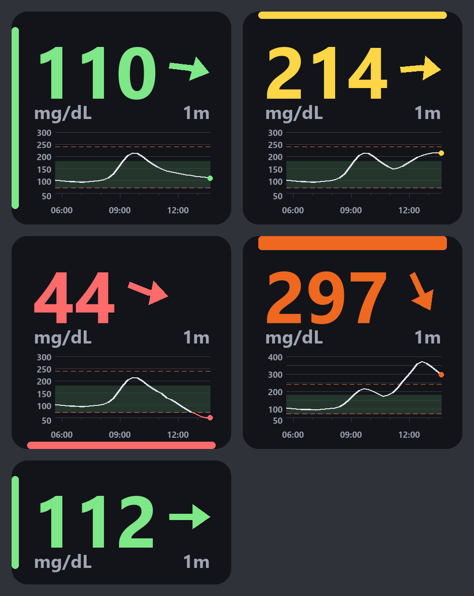

# vr-cgm-overlay

A SteamVR overlay that keeps your current blood glucose on your wrist
while you play. Readings come from LibreLinkUp.

It runs as an OpenVR overlay, so **no game needs modding or patching** —
the face composites over any SteamVR title.



## Design

```
┌─ LibreLinkUp Cloud (api-jp.libreview.io and friends) ─┐
│  POST /llu/auth/login              → token, region     │
│  GET  /llu/connections             → patientId         │
│  GET  /llu/connections/{id}/graph                      │
└────────────────────┬───────────────────────────────────┘
                     │ HTTPS every 60s (jitter + exponential backoff)
┌────────────────────▼───────────────────────────────────┐
│  vr-cgm-overlay (resident, single process)              │
│                                                         │
│    librelink.py ──→ renderer.py ──→ overlay.py          │
│    auth + fetch     PIL drawing      pyopenvr           │
│                                                         │
│    main.py: 60s fetch loop / 1s draw loop               │
└────────────────────┬───────────────────────────────────┘
                     │ SetOverlayTransformTrackedDeviceRelative
           ┌─────────▼──────────┐
           │ SteamVR Compositor │ → wrist-tracked, over every game
           └────────────────────┘
```

### Decisions worth knowing

**Fetching and drawing run at separate rates.** The sensor updates about
once a minute, so polling faster returns nothing new and only risks being
cut off by Abbott. The age readout and controller tracking, though, need
to refresh every second.

**The last reading stays up when the network drops**, but its age keeps
climbing and it greys out past ten minutes. A display that silently
freezes mid-session is the dangerous failure, so stale has to look stale.

**Range checks are always mg/dL**, even in mmol/L mode, so switching the
display unit cannot quietly change what counts as a low.

**`config.toml` is watched, not just read at startup.** Placement can
only be judged with the headset on, and restarting for each nudge means
taking it off again. A bad or half-written edit is logged and ignored
rather than taken.

**Arrows are drawn, not typeset.** Segoe UI and the other stock Windows
fonts have no U+2197/U+2198 glyphs and render tofu boxes. The trend
matters nearly as much as the number, so it does not depend on a font.

**Credentials live in `config.toml`, which git ignores.** That file grants
access to health data; keep it out of the repository.

### LibreLinkUp API quirks

This is an unofficial API, so the client works around the failures that
have actually been reported against existing clients.

| Quirk | Workaround |
|---|---|
| A stale `version` header is rejected with a 4xx | `api_version` in `config.toml` |
| Login answers with a region redirect | Follow `data.redirect` and log in again (once) |
| `account-id` header (SHA256 of the user id) required | Derived at login, sent on every later call |
| `Timestamp` is local time with no zone | Age is computed from `FactoryTimestamp` (UTC) |
| No token while terms or email verification are pending | `step.type` is detected and explained |
| Tokens expire with no refresh endpoint and no warning | A 401 triggers one automatic re-login |

## Setup

```bash
pip install -r requirements.txt
cp config.example.toml config.toml
```

Put your LibreLinkUp `email` and `password` in `config.toml`.

That file holds your password, so it is excluded by `.gitignore`. Do not
share or commit it.

Check the API before involving SteamVR.

```bash
python src/main.py --dry-run
```

A glucose value on the console and a `preview.png` on disk means the API
side is done. Then leave it running.

```bash
python src/main.py
```

## Tuning

**`config.toml` is re-read while the app runs**, so edits show up in the
headset within a second. Leave it running, keep the headset on, and
change one number at a time. Only `hand` and the `[account]` settings
need a restart, and the log says so when one of them changes.

Getting the watch face where you want it is trial and error. The loop is:

1. Start `python src/main.py` and put the headset on.
2. Bring up the desktop view in SteamVR so you can edit `config.toml`
   without taking the headset off.
3. Change one value, save, and look at your wrist.

Each time the placement changes, the log prints what it became:

```
placement: offset=[0.000, 0.020, 0.100] rotation=[-40.0, 0.0, 0.0]
```

### What the numbers mean

`offset` is in **metres** — `0.01` is one centimetre. `rotation_deg` is
in **degrees**. Both are relative to the controller, not to the room, so
they follow your hand around.

Point the controller away from you, like a torch. Then:

| | Raising it | Lowering it |
|---|---|---|
| `offset` X | moves right | moves left |
| `offset` Y | moves up, off the back of the hand | sinks it into your arm |
| `offset` Z | slides it back towards the elbow | slides it forward past the hand |
| `rotation_deg` X | tips the face away from you, flat onto your arm | stands it up towards your eyes |
| `rotation_deg` Y | swings the face to the right | swings it to the left |
| `rotation_deg` Z | spins the face in place, like turning a dial | spins it the other way |

### Fixing what you actually see

| It looks like | Change |
|---|---|
| Sitting on the back of the hand, not the wrist | raise `offset` Z: `0.10` → `0.14` |
| You twist your wrist right over to read it | lower `rotation_deg` X: `-40` → `-55` |
| Floating off the side of your arm | nudge `offset` X by `0.01` (1 cm) at a time |
| Buried in your arm, or clipping through it | raise `offset` Y: `0.02` → `0.04`, or turn on orbit mode |
| Digits run across your arm, not along it | put `90` or `-90` into `rotation_deg` Z |
| Upside down | `flip_vertical = true` |
| Too big, or too small to read | `width_m`, around `0.14` |

Controller origins differ between Index, Touch and Vive, so assume the
first run needs tuning.

### Orbit mode

A fixed placement is bolted to the controller, and that is the problem:
your forearm is not. Rolling your wrist turns your hand about twice as
far as the forearm follows it, so a face that lies neatly on your arm
palm-down is inside your arm palm-up. It does not hide behind the arm
either — SteamVR composites overlays over the scene without a depth
test, so it cuts straight through.

Orbit mode fixes it by modelling your forearm as a line and letting the
face ride around that line to whichever side your head is on, the way a
watch slides round a wrist. It is then outside your arm whatever your
hand is doing, and square to your eye without you turning your wrist to
read it.

```toml
orbit = true
offset = [0.0, -0.02, 0.10]
rotation_deg = [0.0, 0.0, 0.0]
orbit_radius_m = 0.06
orbit_limit_deg = 120.0
```

Two of the settings change meaning when it is on:

| | With orbit off | With orbit on |
|---|---|---|
| `offset` | where the face sits | a point on your forearm's centreline: X and Y say where the arm runs relative to the controller, Z how far back along it |
| `rotation_deg` | how the face is aimed | a trim on top of the aiming, which is now automatic |

`orbit_limit_deg` is how far round the arm it may travel from the top,
either way. At `120` it stops before it reaches the underside; `180`
lets it go anywhere.

### Tuning it with the guides

Both the line and the circle orbit mode works from are invisible, which
is what makes `offset` hard to set by nudging: you are moving something
you cannot see and judging it by how the face ends up behaving. So draw
them instead.

```toml
arm_guide = true
```

A **cyan line** appears down the modelled centreline of your forearm and
a **magenta ring** on the circle the face travels. Now the settings are
things you look at:

1. **`offset` X and Y** until the cyan line runs down the middle of your
   arm and stays there as you turn your hand. This is the one that was
   guesswork; with the line drawn it is not. Y usually wants to be
   negative, the controller origin sitting above your wrist.
2. **`offset` Z** until the magenta ring is around the part of your arm
   you want the face on.
3. **`orbit_radius_m`** until the ring sits just clear of your sleeve.
4. **`rotation_deg` Z** by 90 or 180, only if the digits come out
   sideways or upside down.

Then set `arm_guide = false`. The guides are a tuning aid, not part of
the display.

`[thresholds]` sets the colour bands. All four are mg/dL and are used
even in mmol/L mode, so changing the display unit cannot quietly change
what counts as a low.

| Reading | Colour |
|---|---|
| below `low_mgdl` (70) | red |
| `low_mgdl` to `high_mgdl` (70-180) | green |
| above `high_mgdl` to `very_high_mgdl` (181-240) | yellow |
| above `very_high_mgdl` (240) | deep orange |

## Known limits

The low-glucose buzz does not work on Quest 3 controllers, and may be
ignored by any device on the newer input system. **Haptics are a
supplement; colour is the real alert.**

## Cautions

- This uses an unofficial LibreLinkUp API. Abbott does not support it, and
  the app breaks if the API changes without notice.
- **Do not use this for medical decisions.** Treat from the official app
  and a glucose meter.
- The polling interval cannot be set below 30 seconds, to avoid getting
  the account blocked.

## License

MIT License. See [LICENSE](LICENSE).
